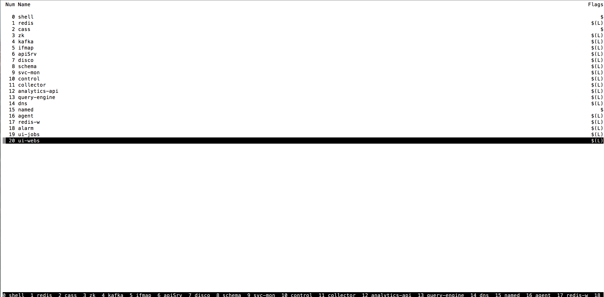
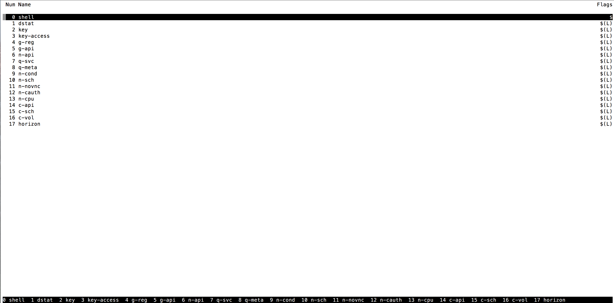

contrail-installer
==================

contrail-installer is a set of scripts and utilities to quickly 
build, install, configure and deploy OpenContrail. It can be used
with pre-build packages (e.g. Launchpad PPA) or from sources. It
is typically used in conjunction with devstack.

# Versions

The contrail-installer master branch generally points to trunk versions 
of OpenContrail components whether sources or snapshots.  For older, 
stable versions, use appropriate release name. 

Currently contrail-installer supports the following:

    contrail-installer: sources master,    devstack: stable/mitaka
    contrail-installer: sources R3.0,      devstack: stable/mitaka
    contrail-installer: packages R2.20,    devstack: stable/mitaka

# OpenContrail localrc

OpenContrail uses ``localrc`` to contain all local configuration and customizations. 
Best to start with a sample localrc.

    cd contrail-installer
    cp samples/localrc-all localrc

CONTRAIL_DEFAULT_INSTALL - Set this to True for installation from OpenContrail binary
packages. When set to False, trunk OpenContrail bits will be downloaded and compiled. 

LAUNCHPAD_BRANCH=PPA - Applicable only when CONTRAIL_DEFAULT_INSTALL is set to True.
It specifies to use released binary packages for installation instead of compiling and
building from sources. Default is to use latest snapshots as this knob is commented out
by default in sample localrc.

PHYSICAL_INTERFACE - This is external interface Vrouter should bind to. It should have
a valid IP address configured. For example eth0

INSTALL_PROFILE - Set this to ALL to for an all in one node. 

USE_SCREEN - Set this to True to launch contrail modules in a screen session called
"contrail". Connect to screen session for any troubleshooting of contrail modules.

LOGFILE - Specify logfile for contrail.sh runs. By default this is log/contrail.log
in contrail-installer directory

# OpenContrail script

Contrail.sh is the main script that supports following options:

    build     ... to build OpenContrail
    Install   ... to Install OpenContrail
    configure ... to Configure & Provision 
    start     ... to Start OpenContrail Modules
    stop      ... to Stop OpenContrail Modules
    restart   ... to Restart OpenContrail Modules without resetting data

# Launching OpenContrail

Run the following NOT AS ROOT:

    cd contrail-installer
    cp samples/localrc-all localrc (edit localrc as needed)
    ./contrail.sh build
    ./contrail.sh install
    ./contrail.sh configure
    ./contrail.sh start

Upon successful run of last command, output similar to below should appear:

    #:~/contrail-installer$ 2017-04-26 12:50:29 +++ echo -ne '\015'
    ++ clean
    ++ local r=0
    ++ echo 'exited with status :0'
    exited with status :0
    ++ exit 0

This will create a screen names "contrail" with a tab corresponding to each contrail service:

    #:~/contrail-installer$ screen -ls
    There are screens on:
        2427.contrail   (04/26/2017 12:48:59 PM)        (Detached)
    1 Sockets in /var/run/screen/S-jenkins.

# Devstack

Trunk of contrail-installer currently works with stable/mitaka of devstack.

    git clone git@github.com:openstack-dev/devstack
    cd devstack
    git checkout stable/mitaka
    
A glue file is needed for devstack to use Contrail neutron plugin

    cp ~/contrail-installer/devstack/lib/neutron_plugins/opencontrail lib/neutron_plugins/

Use provided sample localrc for devstack. Note that this disables some neutron networking services
because these services are provided by Contrail networking plugin. Edit localrc as needed to reflect
your physical interface and host:

    cp ~/contrail-installer/devstack/samples/localrc-all localrc
    HOST_IP=<your host ip>
    PHYSICAL_INTERFACE=eth0

Run stack.sh
    ./stack.sh

if devstack installs successfully, output similar to following will be shown:

    ========================
    DevStack Components Timed
    ========================

    run_process - 71 secs
    test_with_retry - 7 secs
    apt-get-update - 17 secs
    pip_install - 269 secs
    restart_apache_server - 10 secs
    wait_for_service - 29 secs
    apt-get - 9 secs

    This is your host IP address: 192.168.0.175
    This is your host IPv6 address: ::1
    Horizon is now available at http://192.168.0.175/dashboard
    Keystone is serving at http://192.168.0.175:5000/
    The default users are: admin and demo
    The password: contrail123

# Restarting OpenContrail+Devstack

If you need to restart OpenContrail or Devstack for some reason, currently they
need to be synchronized. So

    cd ~/devstack
    ./unstack.sh

    cd ~/contrail-installer
    ./contrail.sh restart
    cd ~/devstack
    ./stack.sh

if issues persist, it might be helpful to reboot server or VM and repeat the steps
below

    cd ~/contrail-installer
    ./contrail.sh start
    cd ~/devstack
    ./stack.sh

# Verify installation
    1) screen -x contrail and run through various tabs to see various contrail modules are running
    2) Run utilities/contrail-status to see if all services are running

# Running sanity
Note that default sample localrc enables simple gateway. A script is available that will
create a virtual network, launch two VMs, ping each VM from host and then SSH into it.
Follow the steps below:

    cd ~/contrail-installer/utilities
    export CONTRAIL_DIR=~/contrail-installer
    export DEVSTACK_DIR=~/devstack
    ./contrail-sanity

# Opencontrail UI
OpenContrail UI runs on http port 8080. It will automatically redirect to https port 8143.
username is "admin", and the password is mentioned in the localrc (default: "contrail123")

# Automating contrail.sh and devstack
contrail-installer/utilities/task.sh attempts to automate steps required by sequential runs
of contrail.sh and devstack. It works off a configuration file. Default called auto.conf is
provided. Following example launches task.sh in binary PPA mode while using R2.20 packages.
See auto.conf for more options to launch in source mode or with use of snapshots

    $ cd ~/contrail-installer/utilities
    $ diff auto.conf my.conf
    17c17
    < ENABLE_BINARY=False
    ---
    > ENABLE_BINARY=True
    22a23
    > LAUNCHPAD_BRANCH=r2.20

    $ ./task.sh my.conf
